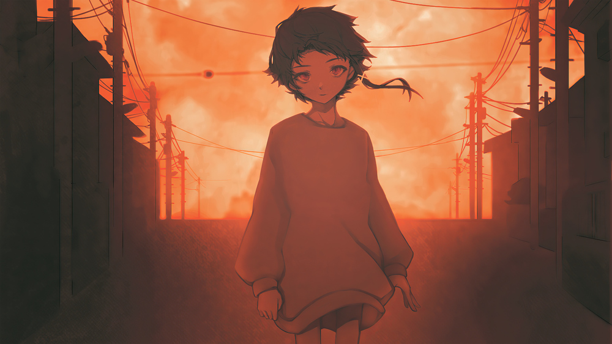
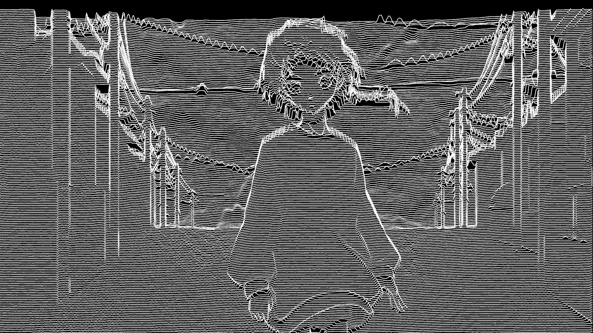
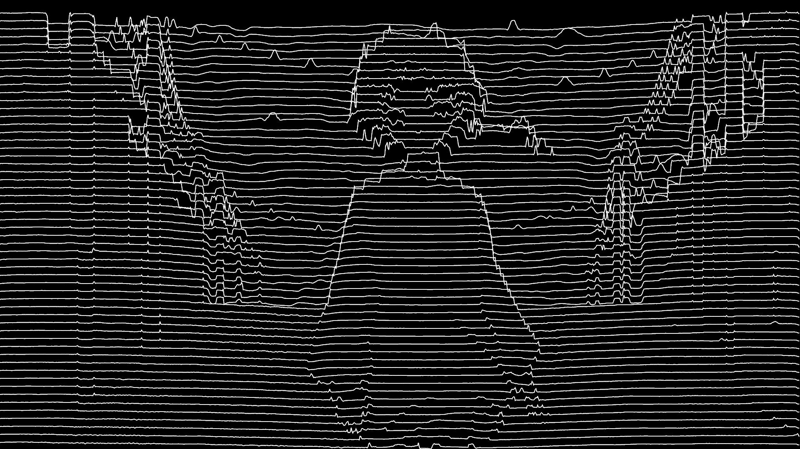

A Pulsar Waveform Image Stylizer (image to joydivision style) made while in train. In the main file you can change the file path or the distance between lines. Greater distance == lower resolution, and vice versa.

